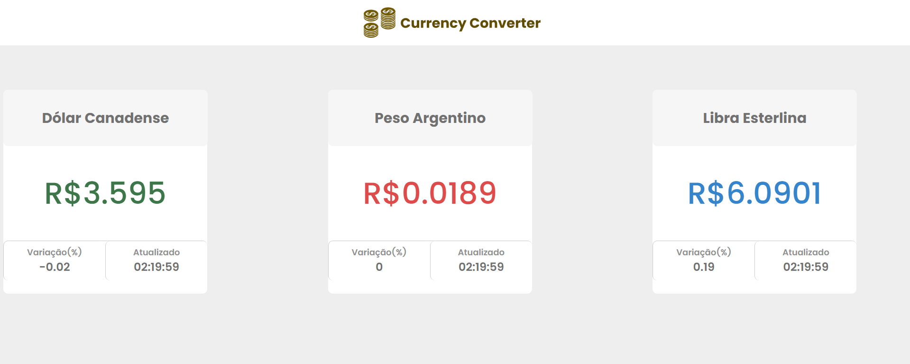

<h1>Currency Converter</h1> 

<p align="center">
  
  
  
</p>

> Status do Projeto: :heavy_check_mark: concluido

### Tópicos 

:small_blue_diamond: [Descrição do projeto](#descrição-do-projeto)

:small_blue_diamond: [Funcionalidades](#funcionalidades)

:small_blue_diamond: [Deploy da Aplicação](#deploy-da-aplicação-dash)

:small_blue_diamond: [Pré-requisitos](#pré-requisitos)

:small_blue_diamond: [Como rodar a aplicação](#como-rodar-a-aplicação-arrow_forward)


## Descrição do projeto 

<p align="justify">
Este projeto foi criado para mostrar a conversão em tempo real das moedas: Dólar Canadense, Peso Argentino e Libra Esterlina em Real Brasileiro.
Exibindo ainda a variação da moeda, e o horário da última atualização.
</p>

## Funcionalidades

:heavy_check_mark: Tela Inicial




:heavy_check_mark: Reload de dados em caso de erro

 


## Pré-requisitos

:warning: [Node](https://nodejs.org/en/download/)
:warning: [NPM](https://docs.npmjs.com/cli/v9/commands/npm-install)
:warning: [Angular-cli](https://angular.io/cli)
 

## Como rodar a aplicação :arrow_forward:

No terminal, clone o projeto: 

```
git clone https://github.com/AriadneSilva/freterapido-code-challenge
```

Abra o prompt de comando, e navegue até o local onde o repositório foi clonado

Execute o comando: npm install. Para realizar a atualização e toda a instalação das bibliotecas necessárias para a execução

Finalizado a execução do comando acima, execute o comando: npm start

Após a execução do comando, automaticamente abrirá uma página do navegador no endereço: http://localhost:4200/ com a aplicação em execução


## Como rodar os testes

```
$ ng test
```


## Linguagens, dependencias e libs utilizadas :books:

- [Angular](https://angular.io/quick-start)
- [JavaScript](https://developer.mozilla.org/pt-BR/docs/Web/JavaScript)
- [CSS](https://developer.mozilla.org/pt-BR/docs/Web/CSS)
- [TypeSricpt](https://www.typescriptlang.org/)
